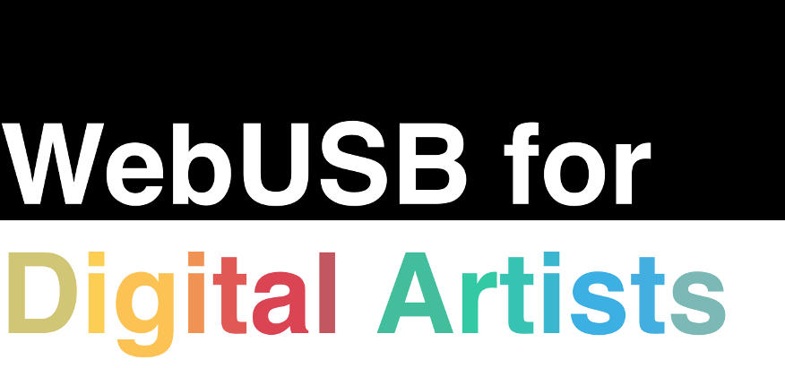

* [Slides](https://timpietrusky.github.io/WebUSB-for-Digital-Artists)
* [Speaker notes](https://timpietrusky.github.io/WebUSB-for-Digital-Artists?present=true)

_I'm using [Dekk](https://github.com/sinnerschrader/dekk) for my slides, that's why certain functionality (such as mobile optimization and touch-events to change the slides) are not here yet. I'm sorry for that, but Dekk is the most advanced slides-framework I know and I need to have custom slides as much as possible!_

## Resources

* [WebUSB <3 Arduino](https://wicg.github.io/webusb)
* [How to build a WebUSB DMX512 Controller by using an Arduino](https://medium.com/@timpietrusky/how-to-build-a-webusb-dmx512-controller-by-using-an-arduino-e0dd8efb7bf0)

## Development

See the [contributing guideline](.github/CONTRIBUTING.md#development). 
